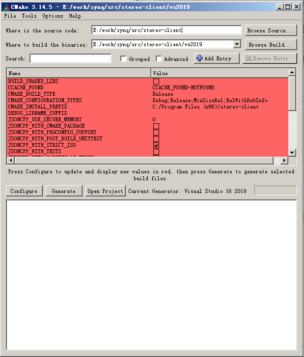

# stereo-client
stereo client


## 1 编译

### 1.1 编译工具  
1.1.1 测试过的编译器  
vs2017  
vs2019  
gcc version 5.4.0  
gcc version 7.3.1

1.1.2 cmake   
cmake version 3.14.5   
cmake version 3.15.2   
cmake-gui    
  

### 1.2 依赖

1.2.1 QT5   
测试过的版本：   
QT5.12.2   

在官网上下载QT安装包进行安装后，需要添加环境变量。   


1.2.1.1 ubuntu环境变量   
QTDIR=/home/wy/dpu/Qt5.12.2/   
PATH=$QTDIR/5.12.2/gcc_64/bin:$QTDIR/Tools/QtCreator/bin:$PATH   
MANPATH=$QTDIR/man:$MANPATH   
LD_LIBRARY_PATH=$QTDIR/5.12.2/gcc_64/lib:$LD_LIBRARY_PATH   


1.2.1.2 windows环境变量   
Path->D:\Qt\Qt5.12.2\5.12.2\msvc2017_64\bin;   

备注：   
屏蔽CMakeLists内的如下语句，那么不编译客户端，可以不依赖QT5。   
#ADD_SUBDIRECTORY(${CMAKE_CURRENT_SOURCE_DIR}/app/zscam_client)    


### 1.3 编译过程

1.3.1 windows下编译     
打开cmake-gui，选择编译器，选择源码路径和工程输出路径，参考下图进行配置。    
     

依次点击“Configure”, "Generate", "Open Project"。    
打开vs后，选择ALL_BUILD右键重新生成。    
编译成功后，选择zscam_client，右键设为启动项目，点击运行。    


1.3.2 ubuntu下编译

mkdir build   
cd build   
cmake ..   
make -j8   
./bin/zscam_client    


1.3.3 交叉编译     

仅供参考，需要修改*.cmake文件。   

1.3.3.1 32位ARM   
mkdir build-zynq    
cd build-zynq     
cmake -DCMAKE_TOOLCHAIN_FILE=../mpsoc.cmake -DCMAKE_INSTALL_PREFIX=../../out ..     
make -j4    
make install   

1.3.3.2 64位ARM     
mkdir build-mpsoc    
cd build-mpsoc    
cmake -DCMAKE_TOOLCHAIN_FILE=../zscam.cmake -DCMAKE_INSTALL_PREFIX=../../out ..    
make -j4   
make install   


1.3.3.4 3531编译
cmake -DCMAKE_TOOLCHAIN_FILE=../3531.cmake -DWITH_ZSCAM_CLIENT=OFF -DCMAKE_INSTALL_PREFIX=../../out ..    
make -j4   
make install  

注意：    
出现报错：    
error while loading shared libraries: libz.so.1: cannot open shared object     

解决方法：
sudo apt-get install lib32ncurses5 lib32z1


### 1.4 搜索设备接口
```
#define BROAD_CAST_PORT 		45789

search_camera *search_;
search_ = new search_camera("zynq_stereo_camera", BROAD_CAST_PORT, 5, 0);

search_->run();//启动搜索服务

vector<string> device_nodes;
search_->get_device_nodes(device_nodes);//轮询搜索到的设备ip

```

### 1.5 获取流数据接口

```

stereo_camera *camera_; 
camera_ = new stereo_camera(0);

camera_->open_device(ip.c_str(), 7070, 9090, index);//打开摄像头设备，index代表流通道：0->960x540, 1->960x1080, 2->64x64，想降低cpu负载且不需要观察实时视频时将index=2。

std::vector<unsigned char> frame_buffer;
std::vector<struct stereo_detect_box> detect_boxes;
struct stereo_gyro_angle gyro_angle;

while(...)
{
	//查询是否有新数据
	int ret = camera_->query_frame(5);
	if (ret < 0) {
		std::this_thread::sleep_for (std::chrono::seconds(1));
		continue;
	}
	
	//获取图像数据，目标检测数据，陀螺仪数据
	frame_buffer.clear();
	detect_boxes.clear();
	memset((void *)&gyro_angle, 0, sizeof(struct stereo_gyro_angle));
	camera_->get_image(frame_buffer);
	camera_->get_detect_boxes(detect_boxes);
	camera_->get_gyro_angle(gyro_angle);
	
	//将jpeg压缩的图像数据转换为QPixmap用于Qt界面显示
	pixmap_.loadFromData((const unsigned char *)&frame_buffer[0], frame_buffer.size());
	
	//对目标信息进行滤波
	xfilter_->compute(detect_boxes, number_state_, focus_box_, stable_state_);
	if ((detect_mode_) && (ptz_track_mode_))
	{
		//将最终的滤波信息的PTZ值发送到云台跟踪模块
		xtrack_->set_focus_pose(focus_box_.pan, focus_box_.tilt, focus_box_.zoom, number_state_, stable_state_);
	}	
	
	//显示陀螺仪数据
	ui.doubleSpinBox_gyro_roll->setValue(gyro_angle.roll);
	ui.doubleSpinBox_gyro_pitch->setValue(gyro_angle.pitch);
		
}
```

### 1.6 常用参数

  
#### 1.6.1 立体匹配参数
```
match_mode_ = STEREO_CAMERA_MATCH_OPEN_MODE;
camera_->set_value("match_mode", match_mode_);//立体匹配算法打开

match_mode_ = STEREO_CAMERA_MATCH_CLOSE_MODE;
camera_->set_value("match_mode", match_mode_);//立体匹配算法关闭

```

#### 1.6.2 中值滤波参数
```
median_mode_ = STEREO_CAMERA_MEDIAN_OPEN_MODE;
camera_->set_value("median_mode", median_mode_);//中值滤波算法打开

median_mode_ = STEREO_CAMERA_MEDIAN_CLOSE_MODE;
camera_->set_value("median_mode", median_mode_);//中值滤波算法关闭


```

#### 1.6.3 纹理滤波参数

```
tex_mode_ = STEREO_CAMERA_TEX_OPEN_MODE;
camera_->set_value("tex_mode", tex_mode_);//纹理滤波算法打开

tex_mode_ = STEREO_CAMERA_TEX_CLOSE_MODE;
camera_->set_value("tex_mode", tex_mode_);//纹理滤波算法关闭


camera_->set_value("post_tex_th", arg1.toInt());//设置纹理阈值
camera_->get_value("post_tex_th", value);//获取纹理阈值

```
 
#### 1.6.4 形态学滤波
```
morph_mode_ = STEREO_CAMERA_MORPH_OPEN_MODE;
camera_->set_value("morph_mode", morph_mode_);//形态学滤波算法打开

morph_mode_ = STEREO_CAMERA_MORPH_CLOSE_MODE;
camera_->set_value("morph_mode", morph_mode_);//形态学滤波算法关闭
 
```


#### 1.6.5 空间滤波参数

```
space_mode_ = STEREO_CAMERA_SPACE_OPEN_MODE;
camera_->set_value("space_mode", space_mode_);//空间滤波算法打开

space_mode_ = STEREO_CAMERA_SPACE_CLOSE_MODE;
camera_->set_value("space_mode", space_mode_);//空间滤波算法关闭

post_gray_mode_ = STEREO_CAMERA_POST_GRAY_OPEN_MODE;
camera_->set_value("post_gray_mode", post_gray_mode_);//灰度后处理算法打开

post_gray_mode_ = STEREO_CAMERA_POST_GRAY_CLOSE_MODE;
camera_->set_value("post_gray_mode", post_gray_mode_);//灰度后处理算法关闭

camera_->set_value("install_height", arg1.toInt());//设置安装高度
camera_->get_value("install_height", value);//获取安装高度
camera_->set_value("install_x_angle", (float)arg1.toDouble());//设置安装俯仰角
camera_->get_value("install_x_angle", fvalue);//获取安装俯仰角
camera_->set_value("install_z_angle", (float)arg1.toDouble());//设置安装横滚角
camera_->get_value("install_z_angle", fvalue);//获取安装横滚角
camera_->set_value("detect_minx", arg1.toInt());//设置检测范围的水平左极限
camera_->get_value("detect_minx", value);//获取检测范围的水平左极限
camera_->set_value("detect_maxx", arg1.toInt());//设置检测范围的水平右极限
camera_->get_value("detect_maxx", value);//获取检测范围的水平右极限
camera_->set_value("detect_miny", arg1.toInt());//设置检测高度的下限
camera_->get_value("detect_miny", value);//获取检测高度的下限
camera_->set_value("detect_maxy", arg1.toInt());//设置安装高度的上限
camera_->get_value("detect_maxy", value);//获取安装高度的上限
camera_->set_value("detect_minz", arg1.toInt());//设置检测范围的最近距离
camera_->get_value("detect_minz", value);//获取检测范围的最近距离
camera_->set_value("detect_maxz", arg1.toInt());//设置检测范围的最远距离
camera_->get_value("detect_maxz", value);//获取检测范围的最远距离

```

#### 1.6.6 屏蔽滤波参数
```
poly_mode_ = STEREO_CAMERA_POLY_OPEN_MODE;
camera_->set_value("poly_mode", poly_mode_);//屏蔽滤波算法打开

poly_mode_ = STEREO_CAMERA_POLY_CLOSE_MODE;
camera_->set_value("poly_mode", poly_mode_);//屏蔽滤波算法关闭

vector<pair<float, float> > poly_mask_points_[2];
camera_->set_poly_mask(poly_mask_points_[1]);//设置屏蔽区域
camera_->get_poly_mask(poly_mask_points_[0]);//获取屏蔽区域


```


#### 1.6.7 背景建模参数
```
bg_mode_ = STEREO_CAMERA_BG_OPEN_MODE;
camera_->set_value("bg_mode", bg_mode_);//背景建模算法打开

bg_mode_ = STEREO_CAMERA_BG_CLOSE_MODE;
camera_->set_value("bg_mode", bg_mode_);//背景建模算法关闭

camera_->do_action("bg_init");//刷新背景

camera_->set_value("bg_space_dist", arg1.toInt());//设置背景建模空间距离阈值
camera_->get_value("bg_space_dist", value);//获取背景建模空间距离阈值

```

#### 1.6.8 检测跟踪参数
```
track_mode_ = STEREO_CAMERA_TRACK_OPEN_MODE;
camera_->set_value("track_mode", track_mode_);//跟踪算法打开	 

track_mode_ = STEREO_CAMERA_TRACK_CLOSE_MODE;
camera_->set_value("track_mode", track_mode_);//跟踪算法关闭	 

detect_mode_ = STEREO_CAMERA_DETECT_OPEN_MODE;
camera_->set_value("detect_mode", detect_mode_);//检测算法打开

detect_mode_ = STEREO_CAMERA_DETECT_CLOSE_MODE;
camera_->set_value("detect_mode", detect_mode_);//检测算法关闭


```

#### 1.6.9 设置网络参数
```
string ip = ui.lineEdit_ip->text().toStdString();
string netmask = ui.lineEdit_netmask->text().toStdString();
string gateway = ui.lineEdit_gateway->text().toStdString();
string mac = ui.lineEdit_mac->text().toStdString();
camera_->set_value("ip", ip);//设置ip
camera_->set_value("netmask", netmask);//设置netmask
camera_->set_value("gateway", gateway);//设置gateway
camera_->set_value("mac", mac);//设置mac
```


#### 1.6.10 其他参数
```
camera_->set_value("http_out_mode", 2);//图像模式:0->摄像头图像， 1->校正图像，2->视差图像。

camera_->set_value("http_out_channel", 0);//设置流输出通道号：0->灰度图或左摄像头，1->视差图或右摄像头
camera_->get_value("http_out_channel", value);//获取流输出通道号


camera_->do_action("save_config");//保存配置

camera_->do_action("reboot", 1);//重启双目，重启前请先发送“保存配置”命令


```

### 1.7 升级双目接口

```
使用ftp协议将升级文件上传到“/opt/zscam/config/update.zip”，然后发送“重启双目”指令，则系统会重启进入升级模式。
```


